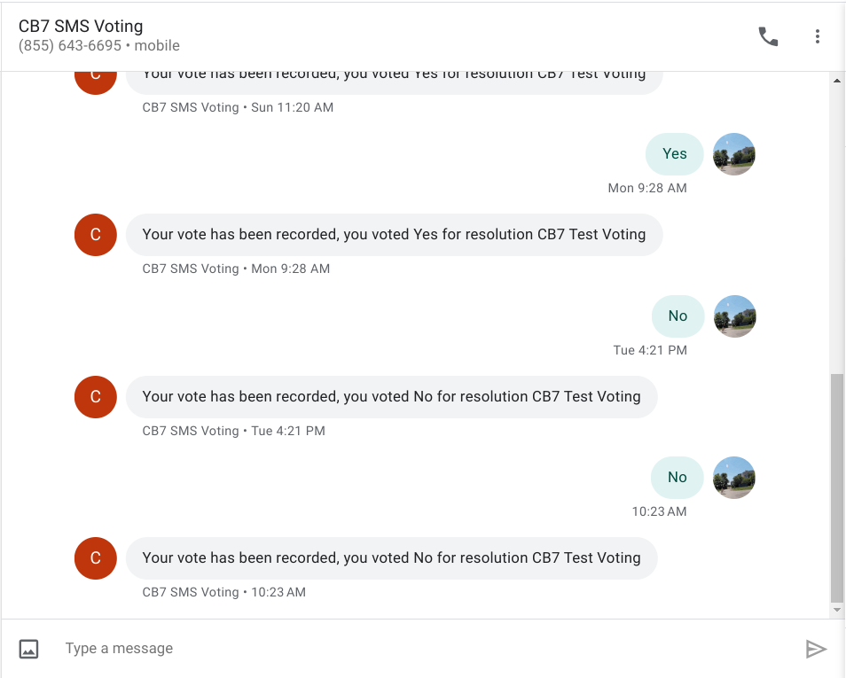
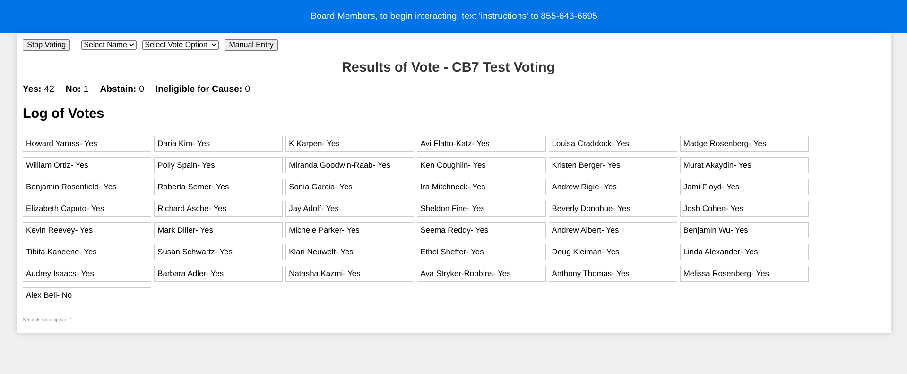

TLDR: I built a little webapp that lets community boar members, identified via their SMS number, vote durring community board sessions. The results are shown on a big screen with countdown clock for speaker, queue, etc. 

# Video of Current voting system

<a href="https://youtu.be/n3V_xCWPv_s?t=7993"> Link to Youtube of Current voting, time 2:13:13 </a>

<iframe width="560" height="315" src="https://www.youtube.com/embed/n3V_xCWPv_s?si=uRuQktVLs5YvGVod&amp;start=7993" title="YouTube video player" frameborder="0" allow="accelerometer; autoplay; clipboard-write; encrypted-media; gyroscope; picture-in-picture; web-share" allowfullscreen></iframe>

The current voting system is hard to manage with some participants remote and some in person, counting ~50 people is not easy. 

# Text Voting

* Everyone can text their vote ('Yes','No','Abstain' , 'Cause')
* Use SMS so its easier to use for the less tech savy vs web app
* SMS also can serve as identification and minor authentication of users
* Dashboard shows countdown timer, queue to talk, etc.

# Images of Voting System

## Countdown clock

 

## Text to Vote

 

## Show Results

 

# GITHUB Link 

https://github.com/Bellspringsteen/community_board_dashboard

# Other

* hosting on Lambda, seems like a good fit for the usage pattern of no interaction for majority of the month and then a few calls. 
* using S3 as store, db seems overkill
* should be very very cheap, twilio is free to respond to text, lambda and s3, should be pennies per month if above the free tier. 

# Whats next?

* See how it goes November 6th
* Convert front end to React?
* Create a admin system?
* Web App for voting if need be?