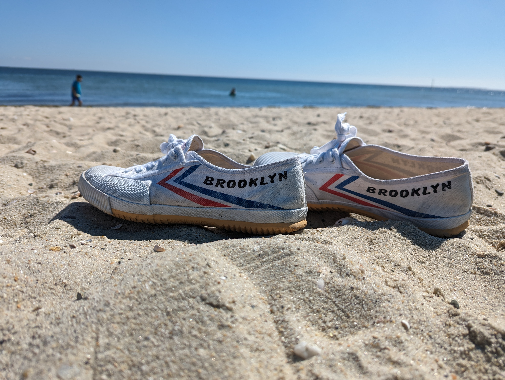
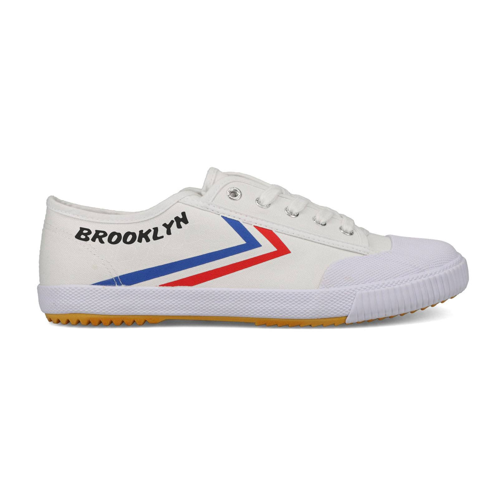
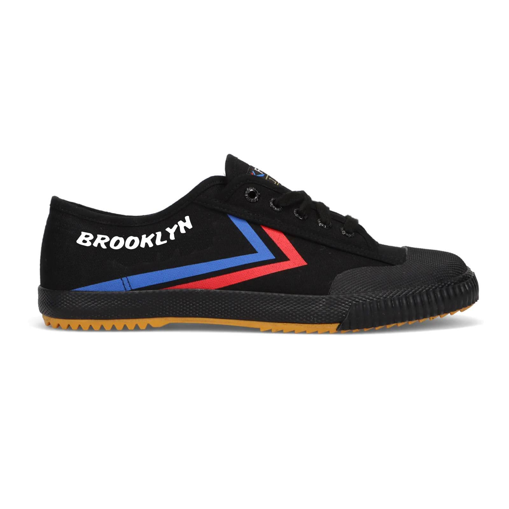
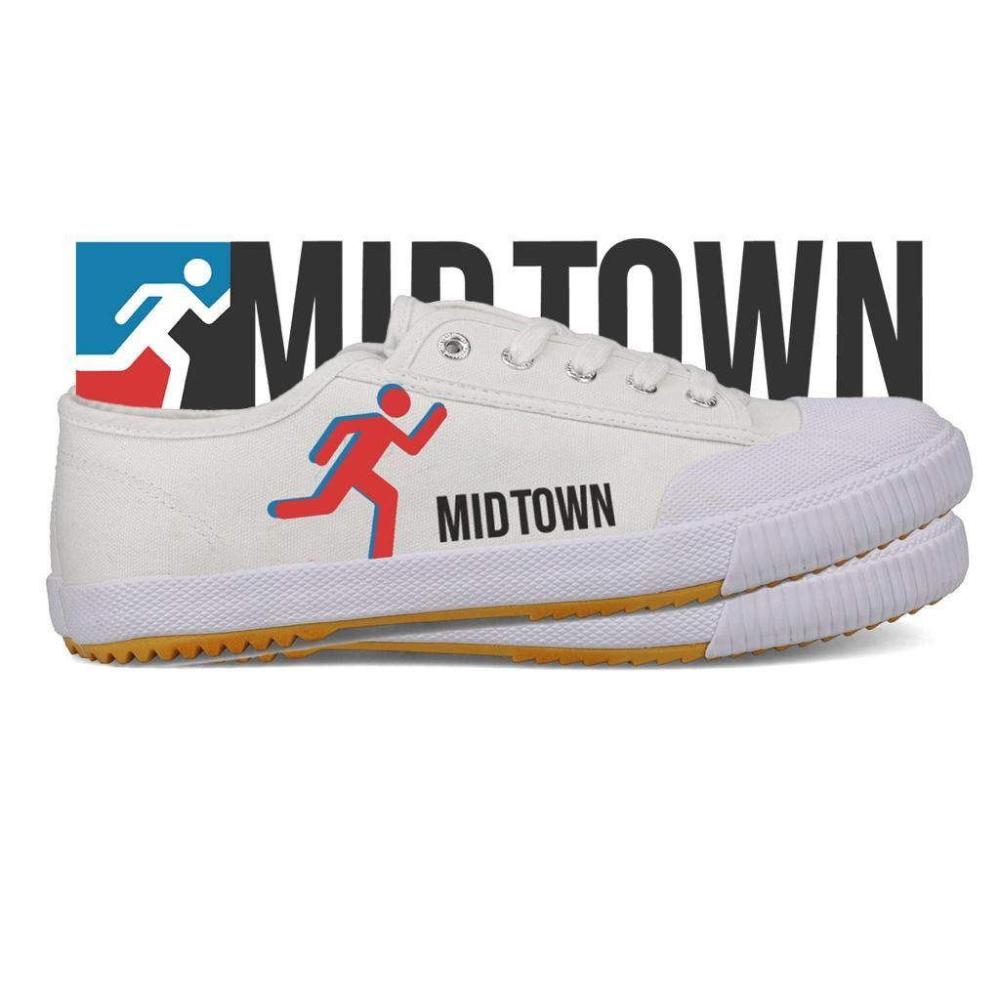

 

 

 

TLDR: For me the perfect shoe is the Dafu Rubber 501 but you can't buy the original product in America because ". Liu Qinglong, manager of Shanghai Da Fu Rubber Co Ltd, said of the situation in 2017, “No one in China knew about commodity intellectual property rights at the time and it wasn’t until 2007–08 that we found out the French had registered the trademark.” ( <a href="https://en.wikipedia.org/wiki/Feiyue"> https://en.wikipedia.org/wiki/Feiyue</a> ) so I contacted the manufacturer, created LLC, renamed to Brooklyn Skippies, they cost $4 to make, $11 to ship worldwide. Launched <a href="https://skippies.xyz/">https://skippies.xyz/</a>
 

 

 

 

 

# What I look for in shoes
 

I only want to own one pair of shoes, so the shoes have to do the following
 

* I want shoes with really flexible and very thin soles. Minimalish because of <a href="https://en.wikipedia.org/wiki/Born_to_Run_(McDougall_book)"> Born to Run </a>
* I want vegan shoes, no leather
* running ( 3-8 miles) most weekend days, moderate pace (8-9 min/mile)
* work/desk/commuting/rain/biking shoes that work in all these environments
* go into a restaurant without looking weird
* go into a business situation without looking weird
* innexpensive ( less than 20$ would be nice)

 

## Search for Shoes
 

* Tyvek Shoes (http://www.unstitchedutilities.com/) these were kind of cool. The real problem was because they were glued together, they would fall apart in 2 months of rough usage. And the tyvek is not that durable. 
* Random cheap amazon ( <a href="https://www.amazon.com/gp/product/B07HQWQ4T7/">Lugz Black Shoes</a>) ok, but the sole is too thick and you dont get that comfortable running feel. 
 
 

Then one day at the office I saw Norman was wearing some Feiyue shoes. I had never heard of them. They looked promising, he had bought his in Taiwan. 
 
 
I started reading the wikipedia page and what a story (https://en.wikipedia.org/wiki/Feiyue) Intrigue. Injustice. I was hooked. 
 
 
I bought a few pairs of shoes over a year on Alliexpress, but they were the Top One Feiyue and the French guys Feiyue-Shoes.com which are not the real deal. I wanted the real deal.
 
 
Watching this <a href="https://www.youtube.com/watch?v=EslrDVTja48&t=1s&ab_channel=Goldthread"> video </a> makes you want the product even more. Vulcanized rubber! A technical nugget maybe explaining what i was looking for. I wanted soft rubber that didnt peel off the canvas. Totally hooked. 
 

## Enter Mr. Liu
 
I tried randomly googled a bunch for Dafu Rubber. Mr. Liu wouldnt accept my WeChat. He would later say " Can't sell in USA, the French guy will sue." I was complaining at work and Qingqiao agreed to help. She called Mr. Liu and spoke in Chinese, explained the idea, he accepted my WeChat reachout. 
 
The price for the original 501s was in the $4 range per pair. But what to call them? 
 

## Brooklyn
 
I don't live in Brooklyn anymore. But I have always lived in NYC. I was talking to Victor, design extrordinaire, and thought well Brooklyn just sounds nice. Victor wanted to call them Midtown
 

 

 
What if you could just write your own text? 
What if we called them BOB?
 
Anyway, Brooklyn seemed as good as anything. Also, to someone who lives in NYC, it just feels good. Brooklyn.  
 

## Brooklyn Skippies
 
But we wanted a separate brand. So the brand is Skippies ( becaues we felt like growing up kids called cheap shoes skippies, but not sure if we were hallucinating) and the current model Brooklyns. 
 

 

 

 

 
Mr. Liu did a legendary job. Custom grommets, printing, I really want to know how he can spin all of this up so fast. The man knows production. We got 2,000 shoes, half white and half black, evenly split across 36 - 44 sizes. 
 
## Shipping
 
So how to get the shoes to customers? The shoes are packaged in boxes with no barcodes just outside Shanghai, China. 
 
* Amazon FBA ( https://sell.amazon.com/fulfillment-by-amazon ) good option, EXCEPT. When shipping to the US, going to cost about 1-2$ per pair for Less than Container Load. US tarrif is 30% on shoes, so thats another ~1$. Then I have to pay Amazon to store and fullfill. By my estimates, I am already approaching 20$ if not more. With a higher risk, if they sell slowly, Amazon will slowly drain my bank account charging storage fees.
* ShipBob aka US fullfillment - Could go with a slightly cheaper US solution like ShipBob. However, calculating the prices. Seems equally expensive. 
* NextSmartShip aka China fullfillment  ( <a href="fulfillship.nextsmartship.com/landing/index.html?nsid=12883">Affiliate link </a>) This is the option I went with. Fullfillment from china keeps the upfront costs cheap. Storage is cheap. The shipping is about 7 days to the US. 
 

Went with <a href="fulfillship.nextsmartship.com/landing/index.html?nsid=12883"> NextSmartShip </a> for now. So far ok. The software is ok, not amazing. You connect it to Shopify. Its still a little manual, once again if you just WeChat your contact everything goes smoother. They put barcodes, sorted, checked merchandise.
 
They charge us about $2 to put barcodes, sort, and setup. Then the shipping is about 9$ to the US and similar to Euroupe ( International shippers, buy a pair! I want to see what shipping is like to Japan or India or Argentina)
 
The packaging is just simple poly ( i.e. plastic ) mailers. 

<blockquote class="instagram-media" data-instgrm-captioned data-instgrm-permalink="https://www.instagram.com/reel/CzSbUZzO5Te/?utm_source=ig_embed&amp;utm_campaign=loading" data-instgrm-version="14" style=" background:#FFF; border:0; border-radius:3px; box-shadow:0 0 1px 0 rgba(0,0,0,0.5),0 1px 10px 0 rgba(0,0,0,0.15); margin: 1px; max-width:540px; min-width:326px; padding:0; width:99.375%; width:-webkit-calc(100% - 2px); width:calc(100% - 2px);">
 <a href="https://www.instagram.com/reel/CzSbUZzO5Te/?utm_source=ig_embed&amp;utm_campaign=loading" style=" background:#FFFFFF; line-height:0; padding:0 0; text-align:center; text-decoration:none; width:100%;" target="_blank"> 
 

 
 

 

 
<svg width="50px" height="50px" viewBox="0 0 60 60" version="1.1" xmlns="https://www.w3.org/2000/svg" xmlns:xlink="https://www.w3.org/1999/xlink"><g stroke="none" stroke-width="1" fill="none" fill-rule="evenodd"><g transform="translate(-511.000000, -20.000000)" fill="#000000"><g><path d="M556.869,30.41 C554.814,30.41 553.148,32.076 553.148,34.131 C553.148,36.186 554.814,37.852 556.869,37.852 C558.924,37.852 560.59,36.186 560.59,34.131 C560.59,32.076 558.924,30.41 556.869,30.41 M541,60.657 C535.114,60.657 530.342,55.887 530.342,50 C530.342,44.114 535.114,39.342 541,39.342 C546.887,39.342 551.658,44.114 551.658,50 C551.658,55.887 546.887,60.657 541,60.657 M541,33.886 C532.1,33.886 524.886,41.1 524.886,50 C524.886,58.899 532.1,66.113 541,66.113 C549.9,66.113 557.115,58.899 557.115,50 C557.115,41.1 549.9,33.886 541,33.886 M565.378,62.101 C565.244,65.022 564.756,66.606 564.346,67.663 C563.803,69.06 563.154,70.057 562.106,71.106 C561.058,72.155 560.06,72.803 558.662,73.347 C557.607,73.757 556.021,74.244 553.102,74.378 C549.944,74.521 548.997,74.552 541,74.552 C533.003,74.552 532.056,74.521 528.898,74.378 C525.979,74.244 524.393,73.757 523.338,73.347 C521.94,72.803 520.942,72.155 519.894,71.106 C518.846,70.057 518.197,69.06 517.654,67.663 C517.244,66.606 516.755,65.022 516.623,62.101 C516.479,58.943 516.448,57.996 516.448,50 C516.448,42.003 516.479,41.056 516.623,37.899 C516.755,34.978 517.244,33.391 517.654,32.338 C518.197,30.938 518.846,29.942 519.894,28.894 C520.942,27.846 521.94,27.196 523.338,26.654 C524.393,26.244 525.979,25.756 528.898,25.623 C532.057,25.479 533.004,25.448 541,25.448 C548.997,25.448 549.943,25.479 553.102,25.623 C556.021,25.756 557.607,26.244 558.662,26.654 C560.06,27.196 561.058,27.846 562.106,28.894 C563.154,29.942 563.803,30.938 564.346,32.338 C564.756,33.391 565.244,34.978 565.378,37.899 C565.522,41.056 565.552,42.003 565.552,50 C565.552,57.996 565.522,58.943 565.378,62.101 M570.82,37.631 C570.674,34.438 570.167,32.258 569.425,30.349 C568.659,28.377 567.633,26.702 565.965,25.035 C564.297,23.368 562.623,22.342 560.652,21.575 C558.743,20.834 556.562,20.326 553.369,20.18 C550.169,20.033 549.148,20 541,20 C532.853,20 531.831,20.033 528.631,20.18 C525.438,20.326 523.257,20.834 521.349,21.575 C519.376,22.342 517.703,23.368 516.035,25.035 C514.368,26.702 513.342,28.377 512.574,30.349 C511.834,32.258 511.326,34.438 511.181,37.631 C511.035,40.831 511,41.851 511,50 C511,58.147 511.035,59.17 511.181,62.369 C511.326,65.562 511.834,67.743 512.574,69.651 C513.342,71.625 514.368,73.296 516.035,74.965 C517.703,76.634 519.376,77.658 521.349,78.425 C523.257,79.167 525.438,79.673 528.631,79.82 C531.831,79.965 532.853,80.001 541,80.001 C549.148,80.001 550.169,79.965 553.369,79.82 C556.562,79.673 558.743,79.167 560.652,78.425 C562.623,77.658 564.297,76.634 565.965,74.965 C567.633,73.296 568.659,71.625 569.425,69.651 C570.167,67.743 570.674,65.562 570.82,62.369 C570.966,59.17 571,58.147 571,50 C571,41.851 570.966,40.831 570.82,37.631"></path></g></g></g></svg>

 
View this post on Instagram

 

 

 

 

 

 

 

 

 

 
 

 

</a>
<a href="https://www.instagram.com/reel/CzSbUZzO5Te/?utm_source=ig_embed&amp;utm_campaign=loading" style=" color:#c9c8cd; font-family:Arial,sans-serif; font-size:14px; font-style:normal; font-weight:normal; line-height:17px; text-decoration:none;" target="_blank">A post shared by skippies.xyz (@skippies.xyz)</a>

</blockquote> 

 

## Cost Breakdown

* $4 for shoes
* $2 for logistics
* $7 for shipping
 
Currently on sale for $20 with free shipping. Maybe this is too low. How am I going to get money to advertise? But what if people just find the shoes overtime? 
 
How can I do cheaper shipping and logistics? I really want to sell the shoes for 9$ with free shipping. That would be sick. 
 

## Is this allowed? 

On instagram, lots of people seem to be suggesting we are committing some faux pas. I am working with the original Dafu Rubber as a partner. International LLC of Florida  has a trademark on the name https://trademarks.justia.com/874/10/feiyue-87410302.html Feiyue, but our shoes dont say that .... 
 
 
The original Dafu 501s are amazing. We just want to help Mr. Liu so that everyone can get the original 501s.
 

## NEXT:

1. how to market
2. European shoes sizes? US shoe size? Are people confused? 
3. Sell on Amazon
4. What if all sellers detailed how much cost went into each product?
5. What about price philosophy, will a cheaper pair of shoes never sell well because people will assume they must not be good.