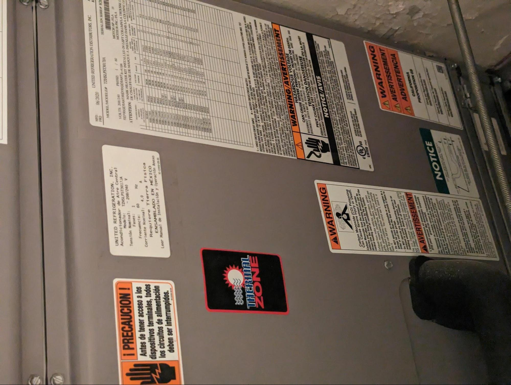

# Electrifying a Upper West Side COOP Building

When I moved into 601 West End Avenue, I was happy to see our apartment had central A/C (40 amp) and 100 Amp 240 service to each apartment. The current heating is natural gas powered steam heating. When our building board announced that the boiler was having issues and that the building was preparing to replace the boiler, I reached out about instead electrifying, which lead to me joining the board and this whole series.

Below is the report I wrote a few months ago after doing a little investigation

### Current State

601 West End Avenue, 13 stories, 2 apts per floor. ( There are 2 duplexes where apts are combined.)

Heating is currently steam heating with a 28HE boiler from 1996 with a heating coil for hot water. 
 
 

 

 
 
Current boiler shows some signs of leaks. There was a large amount of leaking last winter, which may have been from the hot water system or boiler (The hot water system is still leaking out of the vent and now just continuously draining!!) “Leak Stop” was added to the boiler and it doesnt leak now.
 
 

 

 
 
The chimney for the boiler was determined to be in poor shape and upgrading the boiler would require a new chimney. The current quote to replace boiler and chimney is 460k$
 
 
Currently each apartment appears to have 100 amp , 240 v service ( based on looking at panels in the basement). It appears there is additional service to the common areas and also to the elevator. We dont know how to find the total service to the building, can we ask ConEd?
 
 

 

 

 

 
 
Most of the apartments have an old style fuse box, with the A/C powered off of disconnect located next to air handler. 
 
 
Of the 26 apartments, currently 14 apartments have taken a survey on their AC/Heat- 11 of the apartments have Central A/C and 4 have through the wall PTACs ( Fridgedairs, etc). Each apartment has 5 radiators. Most apartments say they are too hot in winter except the penthouse. (Since then everyone has taken the survey, 70% of apartments have central A/C)
 
 

 

 

 

 
 
For the Central A/C the same company in 2003 installed the following units. The condenser is inserted into a PTAC opening. There are drop ceilings throughout the apartments where the A/C ducts run with vents into each room. (ncpe-430-4010 condenser and tzhslpst3017ja air handler) 
 
 

## Electric Heat

Local Law 97 (https://www.nyc.gov/site/sustainablebuildings/ll97/local-law-97.page) is a law in NYC with “The goal is to reduce the emissions produced by the city’s largest buildings 40 percent by 2030 and 80 percent by 2050.” 601 West End Avenues source of carbon emissions is the natural gas which we burn for heat and hot water. Our building  produces 251 US Tons of CO2 in pollution per year (https://energy.cusp.nyu.edu/#/) plus other harmful pollution. The Statue of Liberty weighs about 250 tons, we emit the equivalent of a statue of liberty in CO2 per year. By 2030, NYC will begin a series of penalties that increase for our usage of gas. Instead of spending a roughly similar amount of money on upgrading the boiler and chimney with a new boiler that will last till at least 2050, we are looking to upgrade to electric heat use efficient heat pumps. We believe doing so will improve the comfort of our building ( choose your temperature, no clanking, leaking), improve the value of each apartment ( individually controlled heating&cooling central AC green system) and save our building money on our monthly costs. 
 
 

 

We want to install individual heat pumps for each apartment on the roof. The current vents (IN RED) can be removed. The Blue circle is the current Penthouse heat pump. 
 
 

 

 

 
 
We intend to have conduit ( electric and refrigerant, in RED) run up the side of the exterior wall from the apartments to the roof. 
 
 
For existing central A/C apartments:
* Replace the air handler and connect to existing vents and connect to rooftop heat pump
* Replace thermostat
* Keep the old PTAC in place for now ( to lower costs), next time facade work is happening, brick up and insulate all the PTAC holes and remove PTACs.
 
 
For PTAC apartments:
* Install slim cassettes in the drop ceiling emulating the vents in other apartments. Match vent style as close as possible. 
* Connect lines to cassettes and back to box and then to roof heat pump
* Install a thermostat ( use locations from existing apartments, generally goal is for all apartments to be similar.
* Keep the old PTAC in place for now ( to lower costs), next time facade work is happening, brick up and insulate all the PTAC holes and remove PTACs.

General
If new breaker boxes are required for apartments, upgrade breaker boxes. If not, dont. 
We want to begin this work in October 2023 and complete it over the winter. 

## Financial Incentives
* 5k$ per apartment in $ savings and 30% less in heating costs per year. 
* ConEd  https://www.coned.com/en/save-money/rebates-incentives-tax-credits/rebates-incentives-tax-credits-for-residential-customers
We will apply for the 3k$ per apartment this will gain the building 72$k
* Federal Government (Inflation Reduction Act) https://www.energystar.gov/about/federal_tax_credits/air_source_heat_pumps
* Each apartment can claim 2000$ off their federal tax return. 
* Each apartment will also be able to claim an additional 2000$ when we replace the hot water system.
* Natural gas prices are increasing and NYSERDA suggests we will save 30% in cost heating with electric compared to heating with natural gas. https://stage.apogee.net/mvc/home/hes/land/el?utilityname=coned&spc=hcc
* Avoidance of any local law penalties.

## Benefits

* Each apartment will be able to control their temperature removing the major complaint from the survey about heating.
* No clanking pipes during the heating season and dripping radiator leaks.
* Apartments can remove radiators and gain square footage. 
* Cost will be reduced in the long run. 
* We will remove our buildings source of carbon emissions.
* Value of apartments will increase “ Green building, central A/C with precise control”

## Q&A

* What about split terminal or something that fits into PTACs. 
We dont want to support this solution. While Fujitsu has a solution, it is just as expensive. And it is a slightly niche solution for the NYC market. We prefer a standard solution for longevity. Also the Fujitsu solution is only 12k BTU, its just too small for our apartments.
* What about Hot Water?
We will keep the boiler and the hot water system as is. After our conversion to electric heat, we will look at replacing the hot water system with an electrified solution next. We are doing one at a time to spread out the cost. 
* Who is Wales Darby? 
Wales Darby is a manufacturer representative https://walesdarby.com/ that is a very old HVAC and engineering firm in the NYC area. Brendan Casey is our contact. He has worked for Mitsubishi, Fujitsu and more. He is an expert. 
* Who is the contractor?
We are looking for contractors.
* Who will be providing heat and A/C?
The building will be providing heating and A/C to each apartment. Each apartment is individually metered so the electric for A/C and for heat will appear on each tenant's bill. 
The building will maintain, via our contractor, the A/C systems in each apartment. 
* Will we remove the boiler?
We will keep the boiler for a few years until we Upgrade the hot water
Are comfortable with the performance of the system. 
Then we will remove the boiler and claim the 3k$ per apartment ConEd incentive. 
* What if the current boiler breaks before we finish upgrading to electric heat?
We are making repairs now so the boiler can remain in operation. 
* Can I install an ERV?
There are bathroom vents that are currently near or next to the existing air handler. Is there an option where apartments can pay extra to get a ERV or system like that?
* Doesn’t electricity come from coal and have bad emissions?
No. https://www.nyiso.com/real-time-dashboard you can see our energy mix. 50% has no emissions.  
* Does ConEd have enough power?
Yes. Current peak electric power is in the summer, the heating and cooling electric loads will be similar. 
* What if the building loses power?
Currently if the building loses power our heating turns off. This is because there is electronic control of the boiler. 
* How reliable is heat pump heating?
Fujitsu is a 28 Billion dollar market cap company. They offer 12 year warranty on all solutions. 
* Why not wire the electric to the roof and have all charges on a central bill?
This would require running additional service. In the future, it maybe beneficial to have each tenant pay their own electric for heating/cooling. 
* Have other buildings done this?
Wales Darby can connect us to clients who are thrilled by their conversion. 
https://www.habitatmag.com/Publication-Content/Green-Ideas/2021/2021-February/Upper-West-Side-Co-op-Steps-Into-the-Electrified-Future 
* What about insulation of apartments, air sealing etc?
Each year we can use federal dollars to make further improvements. We feel based on our buildings current energy usage our insulation is fair. After converting to electric, in future years we will improve the air sealing of the facade. 
* Will a scaffolding be required? 
Probably, we will have a scaffold in the back corner this winter already to repair facade, install windows in the rear stairwell.

