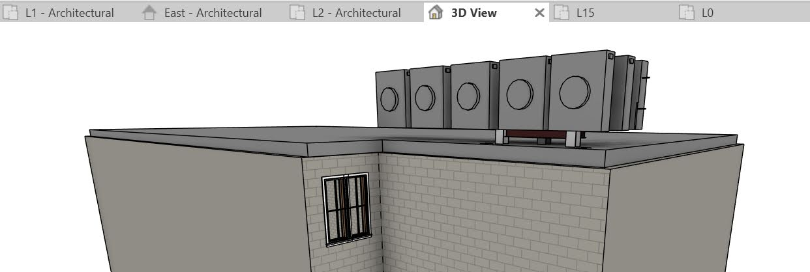
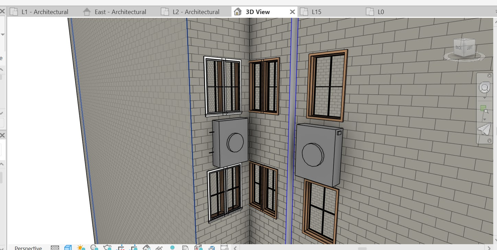
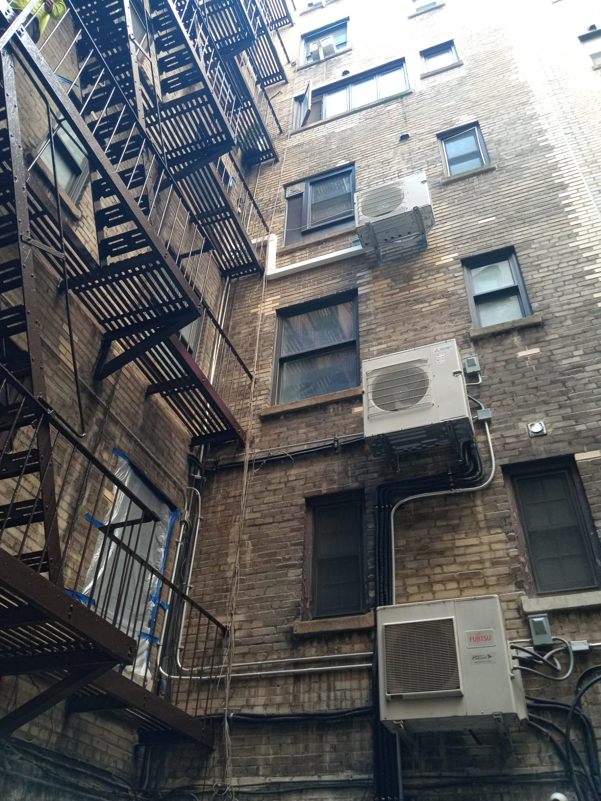
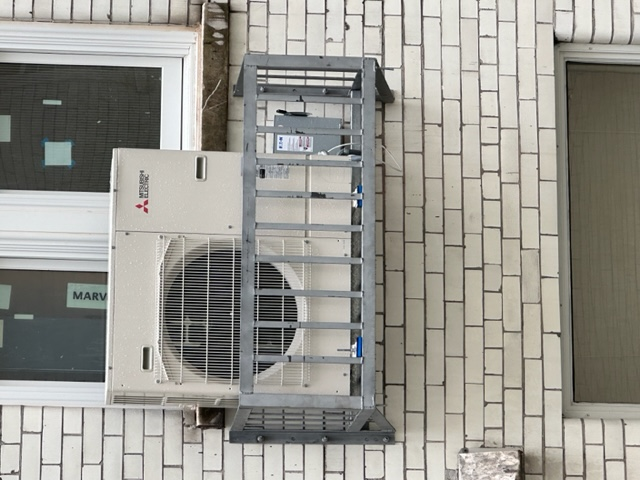

# Electrifying a Upper West Side COOP Building

I joined the building board and we have been doing due dilligence and moving forward

* Asked our building structural engineers about how possible this is
* Found a mechanical engineer to be our Peer review engineer acting on behalf of our building

## Where to Install?

The two options for installation seem to be either on the back wall or on the roof/courtyard.  Roof is more expensive, maybe better for maintenance. Back wall is cheaper.

### Roof

 

* One issue is that the maximum length for the residential units we were looking at is 90 something feet, so we wouldnt be able to get all units on the roof. So some units will have to be in courtyard.
* Requires roof dunnage.

### Rear Wall

 

* Will some residents not like looking out their apartment and seeing units? 
* The biggest issue is that some contractors and others have suggested that servicing and replacing heat pumps installed on the rear wall is dangerous or unwise. Personally, it seems like the best option, very short refrigerant and conduit linesk etc. 

Here are some pictures I have seen from around NYC of units installed on walls. 

 

 

## What to install?

* Manual J Test - Basically i entered in 1300 square feet, the number of windows, etc and its a little more than 30k BTU. But everyone I talked to said, why not oversize? So we are installing 4 Ton. 
* HyperHeat? How low should it go? We decided that as long as its heating at -5F at full power, its fine for NYC.
* Mitsubishi, Fujitsu, Daiken - all pretty much the same. We like Brendan from Wales Darby so will probably go with Fujitsu.

## Contractors

* VRF Solutions - https://vrfsolutionsllc.com/
* Blocpower - blocpower.io
* Prime Air Group - https://primeairgroup.com/
* SaveEnergyAC - https://saveenergyac.us/
* SuperCoolHVAC - https://supercoolhvac.com/
* Master Comfort - https://mastercomfortllc.com/ 

We have bids from all of them, we are considering now which to pick.
