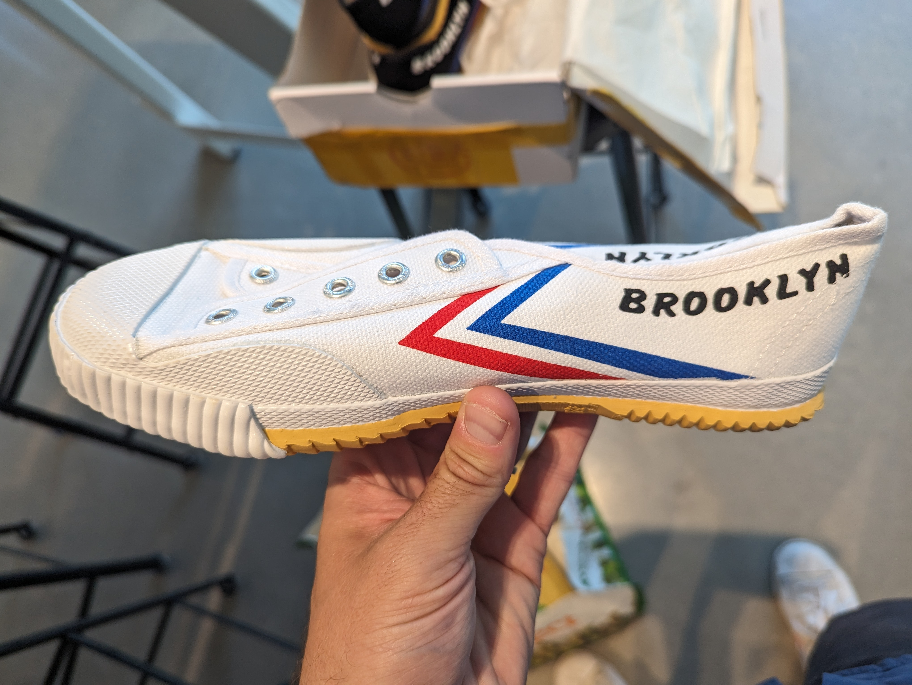
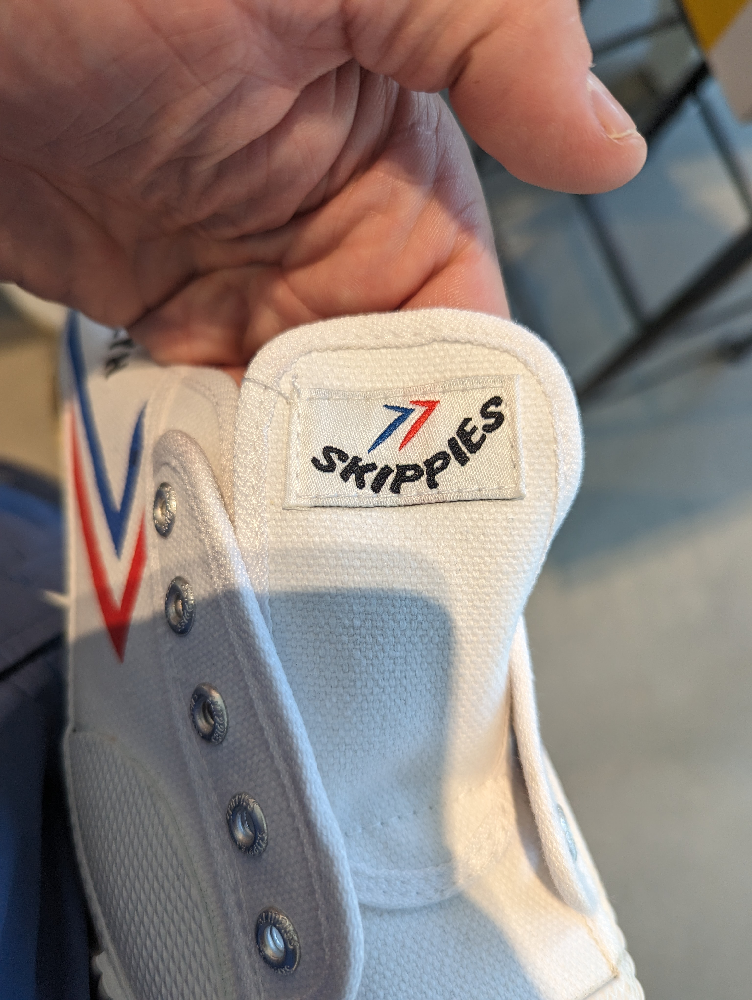

# What I look for in clothes and shoes

I am not interested in standing out, looking flashy, etc. I dont want to buy lots of clothes, I have two pairs of clothes, each night I wash the dirty pair. Its just simpler. Because of this, I just want clothes that

* The per month cost is very low, so either they last a long time or they are cheap, or some iteration of that. 
* Dry very fast
* Dont smell

## Current Status

1. Socks  
https://www.stance.com/stance-performance-tab-socks/TABSOCKSPERFLIGHTRUNLIGHTBLACK.html seem to be mostly nylon. They claim lifetime guarantee. They already sent me 1 free pair when one developed a hole. So far have had the same 4 socks (2 pairs) for 3 years, no complaints. 
 
2. Shorts 
https://www.amazon.com/gp/product/B092SLNCJC/ nylon of course. They went to thin on the thread and the pockets have holes. Not happy. Needs thicker threads and less thread count. Needs nylon pockets. Needs to get rid of the whole cargo pocket things. 
 
3. Long Pants 
http://www.mcmenterprise.net/ and https://www.facebook.com/McmEnterprise/ I could not find good long pants. All the nylon ones looked tactical. So I got some 100% nylon, abrasive resistance, breathable with no coating shipped. And then I went to MCM in Brooklyn. They made me pants that have been going great for 3 years. They kind of look like suit pants. I wear them running, office, etc. Fantastic.
 
4. Underwear 
https://www.amazon.com/gp/product/B07XMDPQ1M/ 100% Nylon. Perfect. Its a knit type material. Fantastic. 
 
5. TShirt 
https://www.amazon.com/gp/product/B08JHP6MVM/ the material is great. Been wearing for 2 years. All the pockets is the bad part, why so many pockets. Need the same shirt without the pockets. 
 
6. Shoes 

Which brings us to shoes. 

## Today, Discussing Shoes
I read the book Born to Run ( https://en.wikipedia.org/wiki/Born_to_Run_(McDougall_book)) so of course I wanted minimalist shoes. I ran the NYC marathon in running sandals. 

* TyVek Shoes - I wore some pairs of these for a while http://www.unstitchedutilities.com/ but they dont last very long and cost about 40$. 

* Feiyue - One day Norman at work was wearing Feiyue shoes that he had got on a recent China trip. https://en.wikipedia.org/wiki/Feiyue incredible story of an old brand with a simple shoe but then loosing the trademark etc. I ordered some Feiyues form Aliexpress that cost about 25$ with shipping. They were from TopGun not Dafu Rubber, so not the originals. BUT, I could tell they were great.

Some of the great things about them
* Minimalist and very flexible
* Vegan
* Cheapish
* The vulcanized soft rubber makes for a comfortable shoe. I wear them on 5+ mile runs and love them. 

## Importing

So then I went on WeChat (with Alyssa's help) and was able to find Mr. Liu https://www.youtube.com/watch?v=EslrDVTja48 a video about them. We decided to try to import some of the original classic Feiyues. 

Skippies.XYZ  with Brooklyn on the side. 

 

 

## Next Up: Technical look at the shoes

* where do they fail and how?
* what are they made up of?
* How should we ship out and sell them?
* Green Triangle vs Red Dot
* Interview with Mr. Liu?
