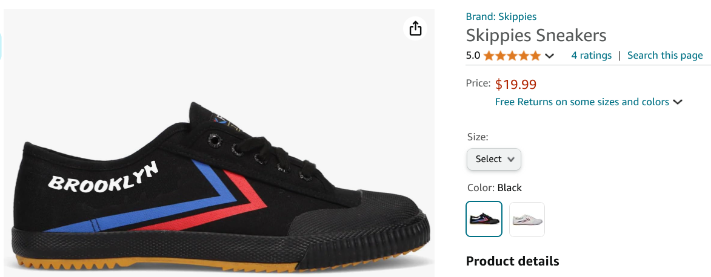
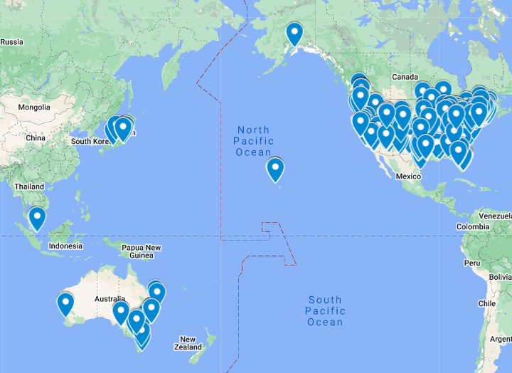
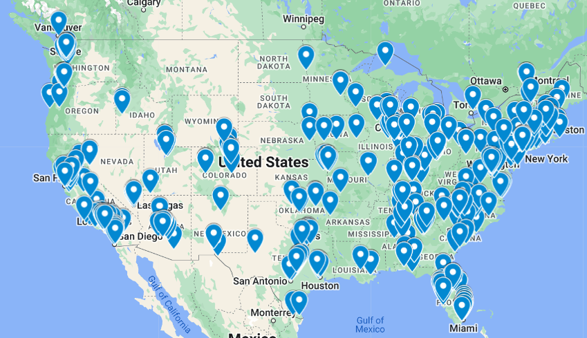

## We have sold over 1500 pairs of shoes! And so far the reviews are great ( pics of amazon and meta reviews, comments ) 
 

 

 

 

## To Where?
 

 

 

 

 

## Refunds, Lost Packages, Etc

Of the 1500 pairs, we had 6 returns and 10 shipments that went missing and we had to refund. 

## Shipping Costs

We ship most of our packages direct from Shenzhen, China using NextSmartShip. They have warehouses which pack our shipments and then ship to individual last mile companies like SpeedyX(https://speedx.io/) or other smaller last mile companies. In rural areas or places with no last mile companies, they use USPS. 
 
Here are some example costs  

$11.13 - Florence, Oregon 
$15$ Hawaii 
$13.44 Feeding Hills, MA 
$12.32 NYC 
$7 New South Wales, Australia 
6.9$ London, England 

We do have some shoes in NYC, if we ship these here are example prices. 

NYC - 8$
Far - 10$
But of course this also requires that we ship the shoes from China to the US first. This suggests that its cheaper to ship direct from China. 

## Amazon

We sold 31 pairs through amazon. They take 3$ per pair, just to host. Plus the monthly fee to sell on Amazon. And on top of that, the Amazon customer thinks they can just order a bunch of sizes and return the rest. Selling on Amazon is terrible. 

## Some other interesting notes

* During the holidays, prices go up significantly. Do other brands just eat this cost and reduce profit during holidays? In the future, we might just stop selling during the holidays, the cut in profit is too much. 
* https://www.nytimes.com/2023/11/04/business/dealbook/us-retailers-say-an-old-trade-law-puts-them-at-a-disadvantage.html for items under 800$ there is no duties or fees for importing. This is very much in the news.
* White shows are more popular than black, but only slightly so. 
* We bought too many small shoe sizes :( . In the US, sizes 36, 37, 38, 39 are rarely purchased, we should have just bought size 40+, we have a few hundred really small shoes left. 

## $$$
We made an average of 4$ of profit per pair!

## Whats Next?
* Maybe the small shoes should just donate or write off.
* New design! In the works, check Instagram

