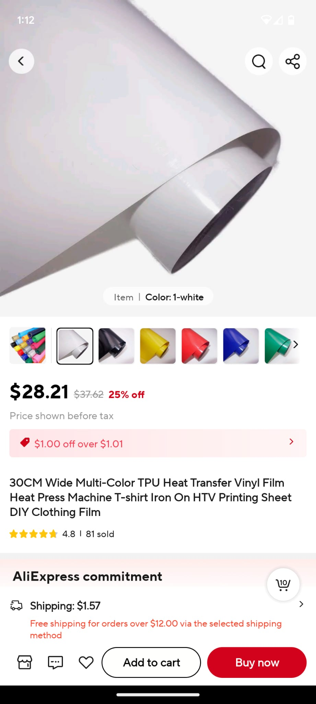

## Inflatodrone

TLDR: Goodyear made a inflatable plain out of "Air Mat" which we now call Dropstitch fabric decades ago. To remake it today, get some dropstitch fabric, laminate on lightweight film, strap some electronics and launch. Benefits are very durrable to crashes, potentially great for big long wings with low wing loading, made on a automated loom so potentially cheaper and quicker to manufacture.

<iframe width="560" height="315" src="https://www.youtube.com/embed/D4UavkT8cYE?si=rOEMLalHGAjpuD_C" title="YouTube video player" frameborder="0" allow="accelerometer; autoplay; clipboard-write; encrypted-media; gyroscope; picture-in-picture; web-share" referrerpolicy="strict-origin-when-cross-origin" allowfullscreen></iframe>

## Inflatoplane

<a href="https://en.wikipedia.org/wiki/Goodyear_Inflatoplane"> https://en.wikipedia.org/wiki/Goodyear_Inflatoplane</a> 
 
The Goodyear Inflatoplane was an inflatable experimental aircraft made by the Goodyear Aircraft Company, a subsidiary of Goodyear Tire and Rubber Company, well known for the Goodyear blimp. Although it seemed an improbable project, the finished aircraft proved to be capable of meeting its design objectives, although orders were never forthcoming from the military. A total of 12 prototypes were built between 1956 and 1959, and testing continued until 1972, when the project was finally cancelled.
 
<a href="https://www.youtube.com/watch?v=2gGygxDIJX0"> https://www.youtube.com/watch?v=2gGygxDIJX0</a> 
 

## Inflatodrone

I cant find on the internet many recent attempts at building a inflatable plane like the original inflatoplane, so I decided to try.  

### Parts

#### Wing
1. I used the https://fwcg.3dzone.dk/ online calculator to sketch out a simple wing. I used a relatively boxy design because straight lines are easier to cut and sew. 
2. If you are looking for USA based expertise in dropstitch fabric, your best option is https://www.thirddimensiontextilesolutions.com/ and Will send me some 2 inch thick fabric.  
3. I bought TPU film from Alliexpress 
 
4. I used a simple Heat Transfer Iron to press the film over the wing. I applied two layers of film. The first time I made a wing, i only used 1 layer however the process of applying the film created some small tears.  
 

Wing Building 
* AirTight: I can't seem to make them airtight not like the professionals. So my wing leaks air. I solved that by adding a mini 12v air pump and a m0 microcontroller + a air pressure sensor (AITRIP 3PCS Air Pressure Sensor Module Board 3.3-5V Digital Barometric Pressure Sensor )
* Delamination: Commercial drop stitch in paddleboards etc can withstand 20psi. I have seen versions that go as high as 100 psi before rupture. My wing starts delaminating at 1-2 psi. This is becaues the TPU just doesnt stick well. Do you know how to make laminations stick better DIY? Write me.  

1. I have also experimented with spraying or painting a layer of latex paint on the dropstitch. This kind of works but the edges are difficult and leak heavily. 
2. Professionally, laminators and other coaters apply PVC and TPU airtight layers that can take up to 100 psi!!! That would be amazing. However, currently all the commercially available films are too heavy. If you are a coater/laminator reach out to me.  
3. My current fabric and TPU is about .6 grams per square inch  
 
##### Electronics 
I just randomly bought the following. I dont know much if anything about R/C aircraft. 
1. 40 A esc and 4900KV EDF from Alliexpress.  
2. 3S battery 
3. Speedybee F405 Flight Controller 
 
##### Misc 
1. 9g mini servos 
2. foam board for elevons 
3. 12V mini air pump from alliexpress + m0 feather with code to switch on and off the air pressure sensor (AITRIP 3PCS Air Pressure Sensor Module Board 3.3-5V Digital Barometric Pressure Sensor ). 
 

### Next Up  
* Bigger wings 
* Better pilot + bigger motor  

## Benefits

* Could be made on automated loom assembly potentially faster and cheaper then current foam, composite  
* Durable. Crashes repeatedly and is fine.   
* Inside could be used to hold fuel?   
* Packs down very small and instantly unpacks   
