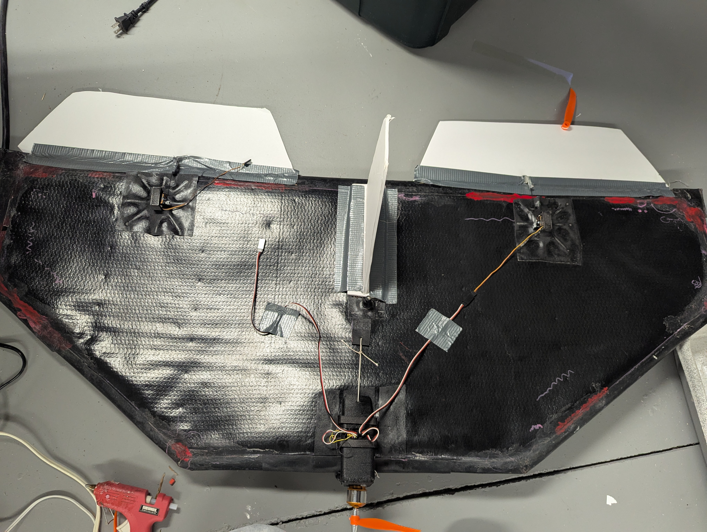
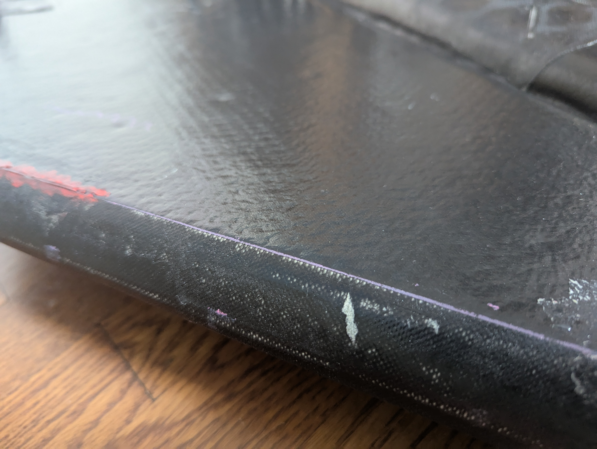
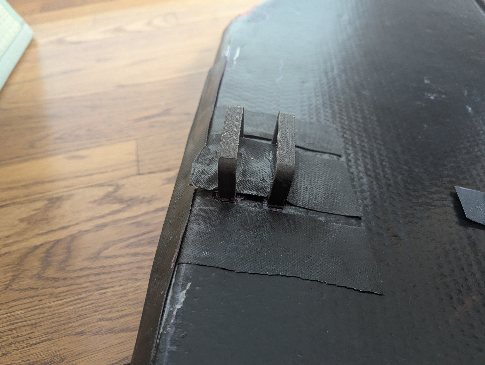

## Inflatoplane 1.1

TLDR: Got better drop stitch material, now it really flies well! 

<iframe width="600" height="400"
src="https://www.youtube.com/embed/etC2IrYUyDo?si=Y_YmFpVxl7CYjiJw"
title="YouTube video player"
frameborder="0"
allow="accelerometer; autoplay; clipboard-write; encrypted-media; gyroscope; picture-in-picture; web-share"
allowfullscreen></iframe>

Part 1, https://blog.labsbell.com/blog/Inflatodrone   

For 1.1, clearly I needed better drop stitch material. Will and Jay from (https://www.thirddimensiontextilesolutions.com/ and textechindustries.com ) supplied me with a 1 inch thick, TPU coated, light weight fabric. (https://www.dropstitch.org/)   

As a relative RC Airplane n00b, I went for a simple shape thats probably not optimal. Better would be more sweep, more thought to CG location.   

## Engine/Electronics Box
  
To attach the electronics I 3d printed out of TPU a box with some holding straps that I glued to the wing. This allows me to easily tie the electronics box on and take it off to swap battery. 
  
Motor went with A2212 motor with 8086 propeller all from alliexpress, cheapest prices. Speedybee mini FC. 
  

## How does it fly? 
  
Well it flies really well compared to version 1 :). Remember that I am a R/C n00b. It it easy to launch, pretty easy to steer around. Propellers usually break off when i land/ crash. When I started flying it, i had elevons sized about 10% of wing and no tails. It would just spin out. 
 

* Angled the motor 3 degrees to the right
*  Made elevons big 25% of wing size
* Added tail

 
Next Steps  

* Trying elevons built into drop stitch. Maybe bending wing to make more airfoil shape. 
* Work with some manufacturers to see how they can make it
* Two motors with differential thrust instead of tail?
* Much much bigger plane
