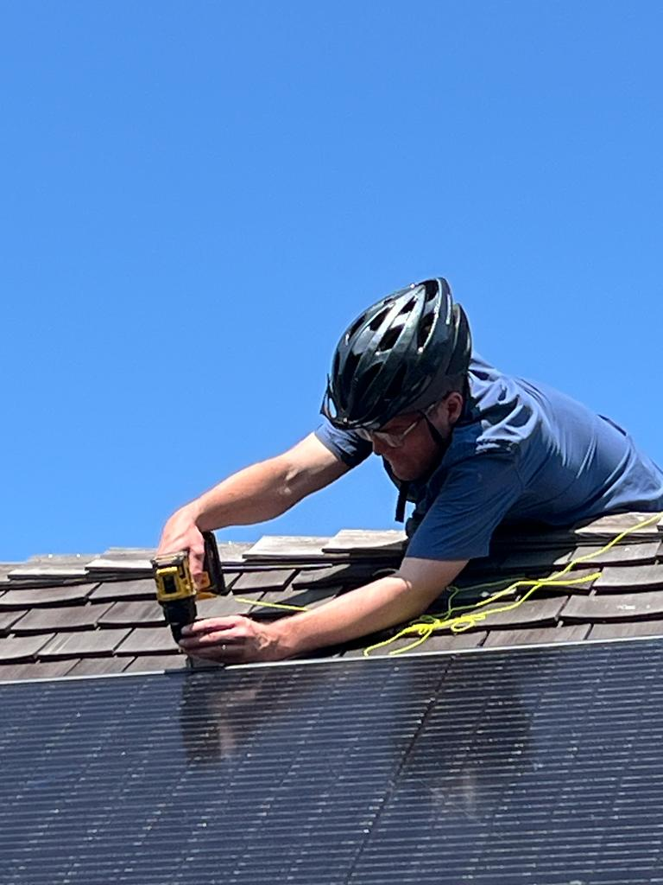
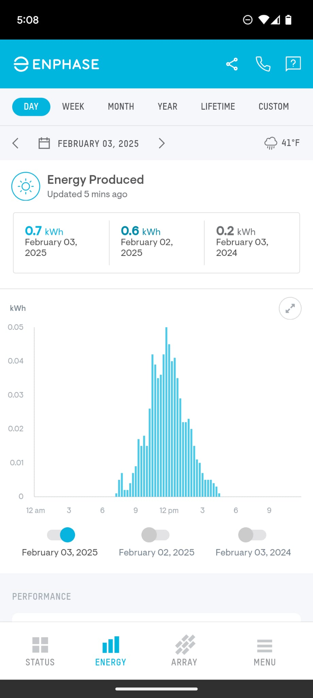
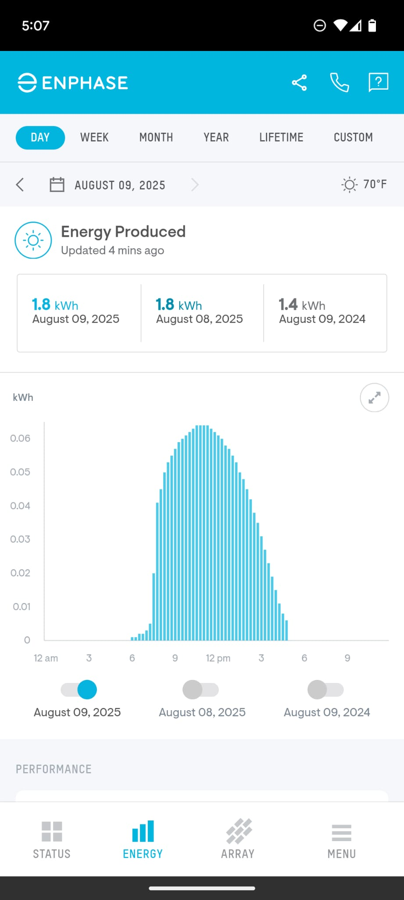
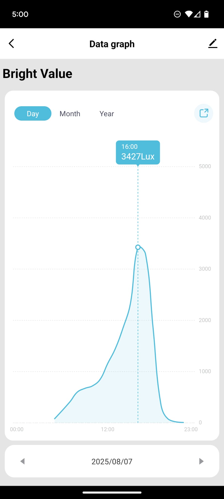
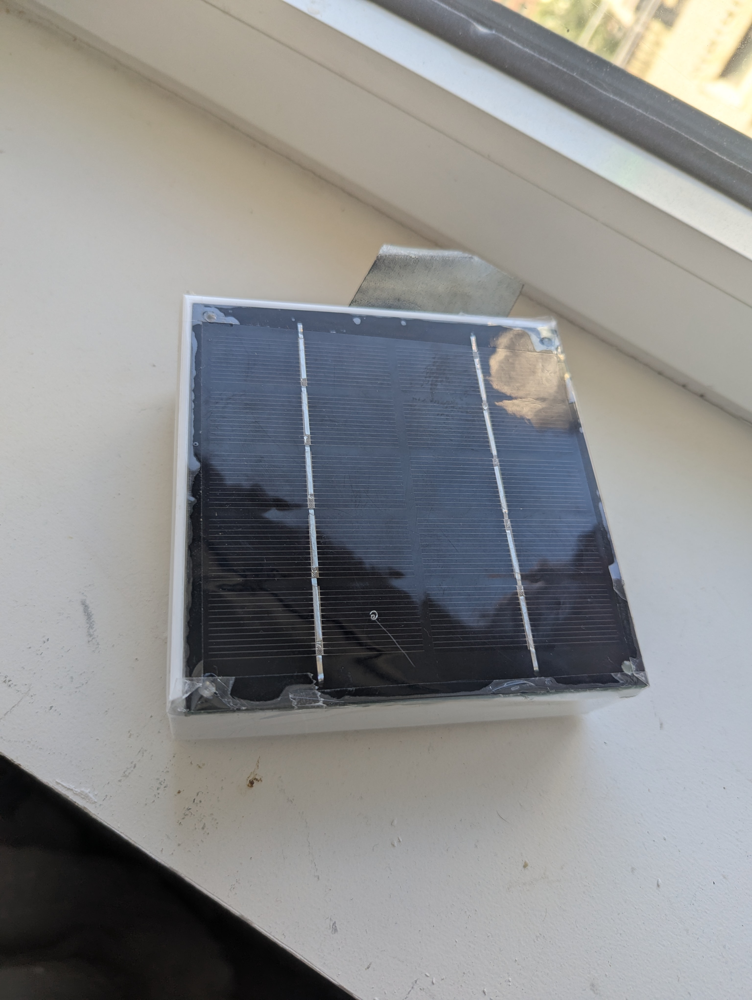

## Solar Things

TLDR: Made a little device solar powered that has been sitting there a year just sending back its voltage as proxy for solar power

## Solar on a Shed

In 2021 I installed a single 440 watt panel, Enphase IQ7PLUS-72-2-US microinverter and enphase combiner box. It may seem silly to put in the work to install just 1 panel, but part of it was I just wanted to see what the install was like. And it was really easy. Rooftop solar could be a much bigger part of energy production in USA if regulation/installation was made easier. 
<div style="text-align:center"> </div>
Bicycle Helmet for safety :) 
<br>
<div style="text-align:center"> </div>
Enphase in February
<div style="text-align:center"> </div>
Enphase in August
<br>
One fun thing is to just occasionally look at the kwh produced. It has been rock solid for 4 years. 


## LUX Sensor

<div style="text-align:center"> </div>
I also bought a Tuya Lux sensor on Alliexpress which logs lux values. I am not sure what the use cases are? Lower shades when gets too bright? Adjust plant watering based on actual lux? 

## Solar Thing


<br>
I wanted to create a long running embedded device that was solar powered. That logged solar power over time. That lasted for years. This should have been easy but I had a real hard time.
<br>
First I tried was super capacitors. Super caps should last a really long time, high power output vs lower energy density. I used a series of Texas Instrument energy harvester modules to charge the super caps. But the problem was no matter what I could do, I couldn't get the super caps to reliably supply the high current draw durring the ESP32 WIFI transmission. I struggled with lots of brownout, the voltage was high enough but durring transmission would get in some kind of brownout lock and the ESP32 would not recover. I also found sites like https://github.com/zkg/solar-powered-ePaper-digital-photo-frame/blob/main/BOM.pdf where people used comparators and diodes to build simple charging off/on devices. I.e. when the voltage gets too low, just turn off the esp32 and turn it back on again when voltage is high enough. Again, this should be simple, but I could not get it to reliably work with ESP32. It would work for a few days and then lockup/brownout again. 
<br>
<div style="text-align:center"> </div>
5 Watt solar panel on plastic box
<div style="text-align:center"> </div>
Inside box
<br>
What I ended up doing was just putting a 18650 cell protected by both a overvoltage and undervoltage protection i.e. on the solar panel input and on the discharge to the esp32.  And I am not using any fancy MPPT controller to maximize charging, just taking the solar panel voltage direct to battery. The solar panel is a simple 5 watt unit, i think 3v or 5v.
<br> 
I have voltage sensing of both the solar panel voltage (through a voltage divider) and battery voltage. And then the code just wakes up the esp32 from deep sleep, reads analog voltages, and sends it to influxdb cloud free tier. And just like the other graphs, i can see the daily charging and discharging of the battery and also any daily fluctuations in true solar energy. 
<div style="text-align:center"> </div>
InfluxDB Cloud

## Code

The github is private because I was sloppy with wifi access codes, etc. But there is the main code.
I use ESP-IDF and the ESP toolchain. 

```c
while (1) {
        vTaskDelay(1000 / portTICK_PERIOD_MS);
        uint32_t adc_reading = adc1_get_raw(ADC1_CHANNEL_3); 
        static float correction_factor = 0.8;
        float voltagebattery = 2.0*(correction_factor)* ((float) adc_reading / 4095) * 3.3;
        uint32_t adc_reading_1 = adc1_get_raw(ADC1_CHANNEL_0); 

        //ESP_LOGI(TAG, "RAW   %i", adc_reading_1);
        float voltagesolar = 2.0*(correction_factor)* ((float) adc_reading_1 / 4095) * 3.3;
        ESP_LOGI(TAG, "VOLTAGES   %f,%f", voltagebattery, voltagesolar);

        if (voltagebattery>2.9){
            vTaskDelay(3000 / portTICK_PERIOD_MS);
            xTaskCreate(wifi_init_sta_task, "Wifi Task", TASK_STACK, NULL, TASK_PRI, NULL);
            vTaskDelay(3000 / portTICK_PERIOD_MS);
            post_server_call_influxdb(voltagesolar,voltagebattery); 
        }

        static uint64_t time_to_sleep_seconds = 60*60;

        // Sleep a different amount of time based on voltage, i.e. sleep less if voltage high. Burn that energy firing off wifi packets. 

        if (voltagebattery > 3.3){
            time_to_sleep_seconds = 60*10;
        } else if (voltagebattery > 3.0)
        {
            time_to_sleep_seconds = 60*60;
        }else{
            time_to_sleep_seconds = 60*60*4;
        }
        
        esp_sleep_enable_timer_wakeup(time_to_sleep_seconds * uS_TO_S_FACTOR);
        esp_deep_sleep_start();

    }

```

## Other Ideas

* camera or other sensor, throw it in ocean? Send it down hudson river? Have it connect to public wifi? Put it on a lightpole? Put it on top of a buildilng? 

* put wheels on it, have it follow white line on highway shoulder, move very slowly, be able to be run over. 

* photoresistor? Solar panel? whats the best true measure of solar insolation? 

