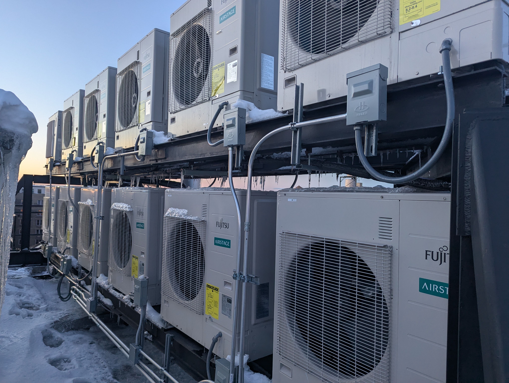
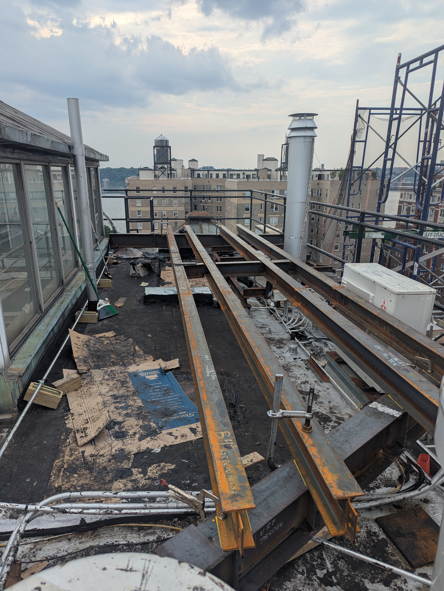

 

## HEATING , DONE

It took way too long. The results are not as good as they should be. I am pleased with the results, but change is hard. 

## Execution

In its simplest form, the installation is easy. There are 26 apartments across 13 floors. 

 

1. Added steel dunnage to the roof
2. Mounted 26 air handlers ARUH48TLAV2, outdoor unit AOU48RLAVS4, each unit has UTY-RNRUZ5 thermostat. UTY-TFSXJ4 for remote configuration. 
3. Run linesets down the buliding, power from each apartments electric panel for individual metering. 

One thing that made this job easier is that about half the apartments already had a central AC system that used a PTAC condensor. So the HVAC power requirements were already there. The apartments have dropped ceilings.And half the apartments already had the ducting. 

## Incentives

One thing that went really right was incentives!! We ended up getting ~450k$ from Coned and NYSERDA.
David Chen at alpineenergy.solutions fantastic.

## Challenges

a. Things just took longer then they should have, the roof dunnage should have been started earlier, but wasnt. This caused issues where we had switched Air Handlers in apartments but the outdoor units were not ready.... so durring summer there was no A/C. Not good. We should have been more patient, done the outside first and then done each air handler and connect everything. Minimize downtime. 

b. The line hides down the building should have been placed over the holes with better thought to placement. As currently configured, there are too many sharp metal corners, places for water to penetrate etc, it makes me nervous

c. The lower apartments used to have an excess of heat and they were lots of lack of air sealing. In addition, our building has zero insulation. We have a 12 inch thick masonry wall from 1920 + layers of lathe and drywall. What this means is that near the walls especially its colder and drafty in some apartments. One way to look at this is that previously with steam heat, the heat was wasted. But there is a comfort adjustment. 

d. The bills are now billed directly to tenants, so that is a hard change. The NYSERDA estimate of 30% cheaper than GAS->Steam seems about what we see. But the issue is you used to have no heatingand now in winter you see 300$ more in the coldest months. Again, its cheaper for you then paying to maintenance and spending more on steam, but suddenly your bill is going up. 

## Next Steps

1. heat pump water heating?
2. Air Stage Cloud to monitor all units? 

## NYC Next Steps

I love the system. I can set temp whenevere. I have the ERV setup and maybe a inline humidifer in the future, the comfort is fantastic. Compared to clanking radiator that didnt heat my apartment, this is amazing. My sisters apartment is equal size, 35 amp circuit. I think for the UWS and NYC, heat pump heating is the way forward, buildings are going to have to get a electric upgrade. I dont know if roof dunnage is the best option,  I would like to see similar to the rest of the world it become standard to just hang the unit outside the window on either platform or bolted to wall. 