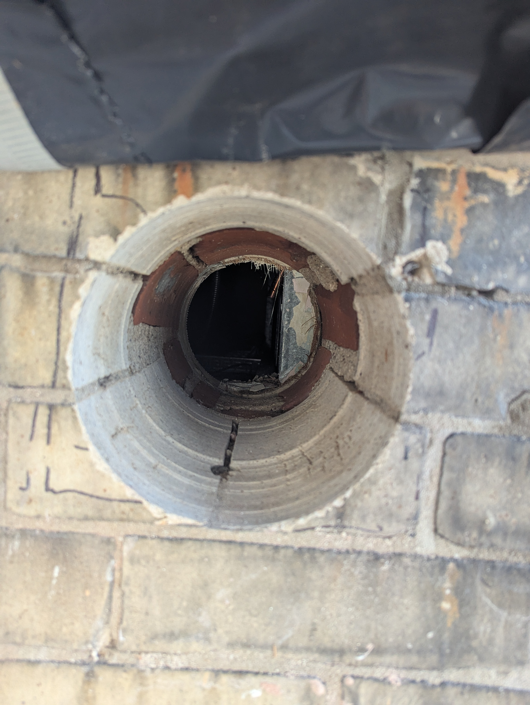
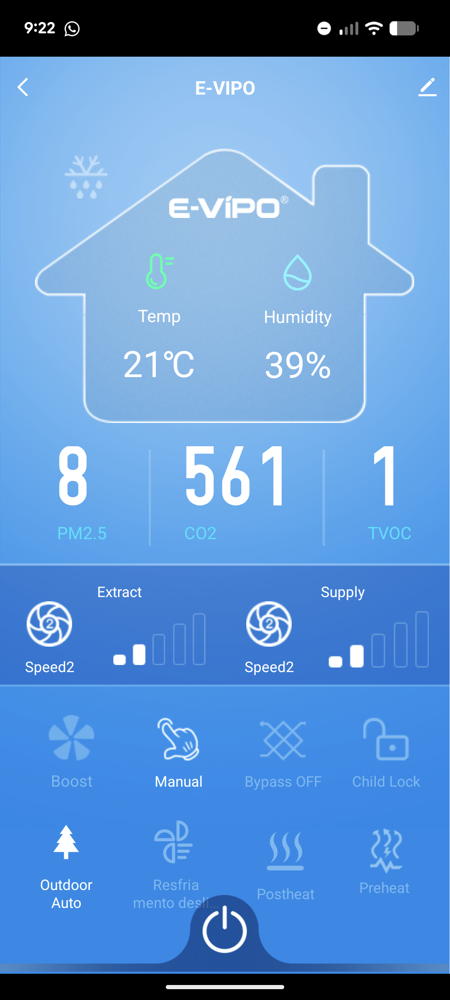
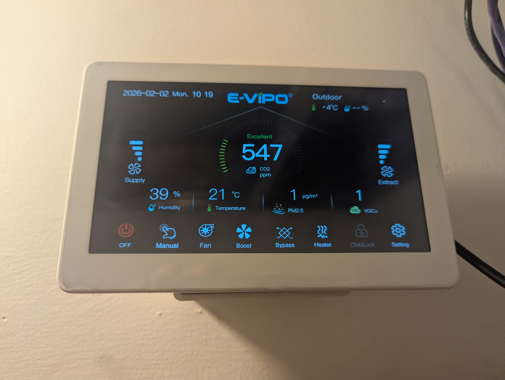

## Buying a EVIPO ERV direct from China

The electrification of the building heat is done ( https://blog.labsbell.com/blog/601WEAElectrificationPart2 , I have to update the series) But now that I am paying for heat, I am even less inclined to want to dump that hard earned heat outside by opening a window. BUT if you dont, starts to smell a little musty and CO2 levels rise...

## ERV

Heat Recovery Venitilation (https://en.wikipedia.org/wiki/Heat_recovery_ventilation) should be the answer. In heating or cooling mode a ERV or HRV will bring the fresh air in without loosing too much heat/cool. 

BUT I also wanted a bypass, so that in the shoulder season of heating or cooling, bypass would just blow the nice temperature air through the apartment forcefully. Also, would be nice to have a unit that easily connected with Home Assistant and automation. 

## Buying ERV

* Panasonic https://iaq.na.panasonic.com/erv makes a series of ERVs that would work for a apartment like mine, but they dont have bypass. 
* Zehnder has a unit which is perfectly sized with bypass. However, you cant just buy it. You have to work with a distributor. The quote I received including the required technician to come and inspect the installation and balacne was 8,500$
* E-vipo https://e-vipo.com/ as is true often these days, I found a Chinese company that seemed to get good reviews, had a series of units with bypass and great specs. I just emailed them direct, they quoted me 577$ for a CS300-ERV-B-Z-EC and 168$ for a VK8 Control Panel. They arranged shipping + any tarrifs etc, door to door shipment and the total was 1,100$. I wired them and two month later a big plywood box arrived. 

## Drilling Holes

For the ERV to work, I needed two 6 inch vents to the outside, as far from each other as possible. This was the most expensive part !! It took a crew of 3 1.5 days to core drill through the wall. 

 

## EVIPO All Set UP

 

 

So far its been great. Very quiet. Adjustable. Software easy to use and automate. 

