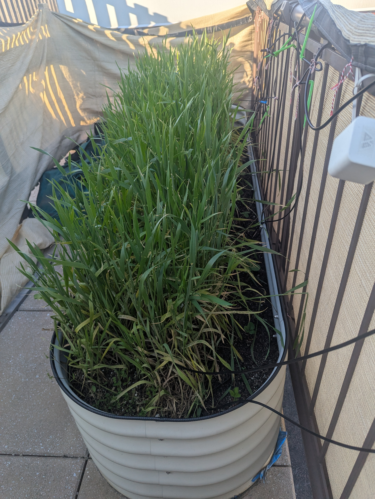
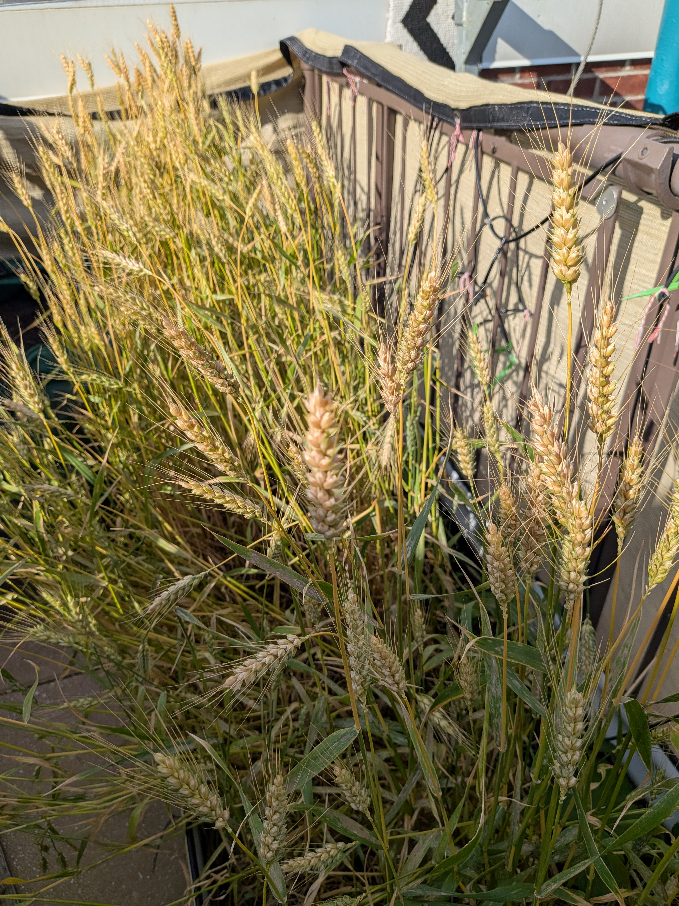
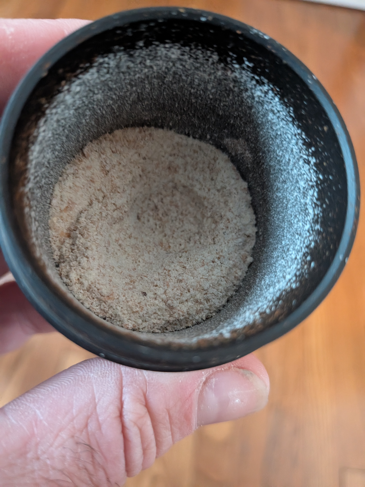
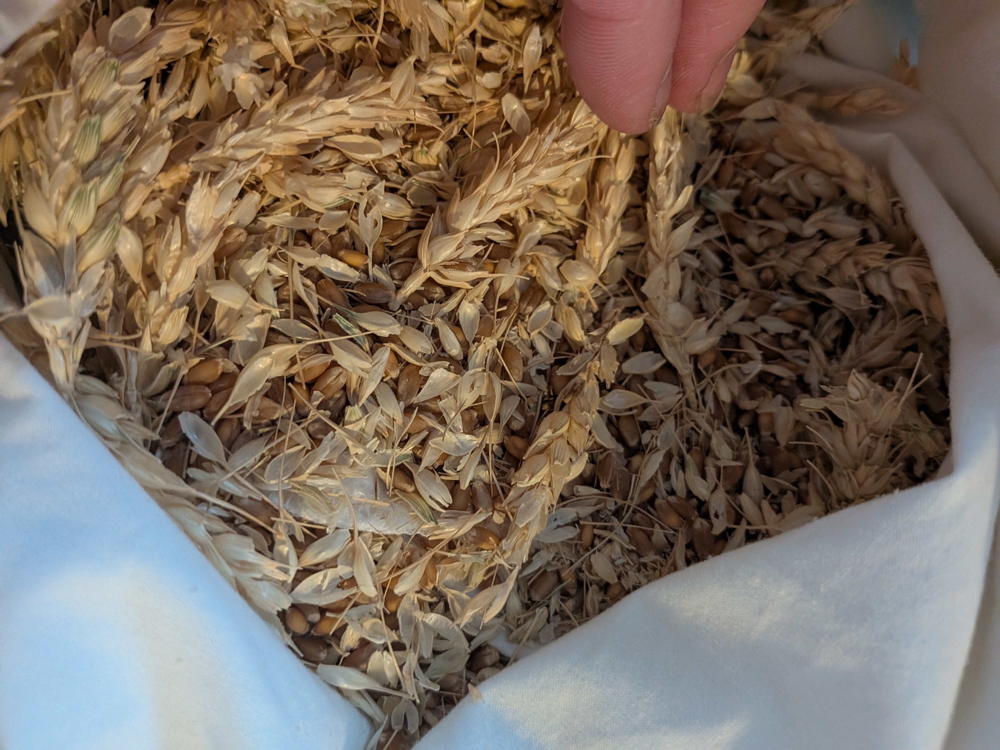
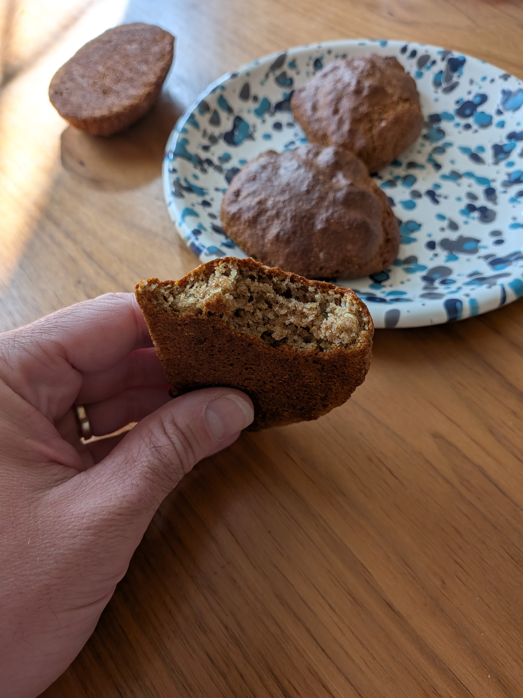

## Growing Winter Wheat in a Manhattan Raised Bed

This year's fun experiment: growing winter wheat in an outdoor raised garden bed in Manhattan. It turned out to be a great project for the kids, and by the end I had milled about 1.5 cups of homegrown flour.

 

## Growing

Winter wheat is planted in the fall, sits through the cold, and then takes off in the spring. In a raised bed it needs surprisingly little attention. The kids loved watching it come up green and then slowly turn golden.

 

 

## Harvesting and Threshing

Once the wheat was golden I let it dry, then cut the tops (the seed heads) off. The low-tech threshing trick: stuff all the heads into an old pillow case and smack the pillow case against the wall. The impact knocks the grains loose from the chaff and heads.

 

## Milling the Flour

After separating the grain, I ran it through an ordinary coffee grinder to make flour. The whole raised bed yielded about 1.5 cups. Not enough to open a bakery, but plenty to bake something with the kids and say we grew it, threshed it, and milled it ourselves.

 

A fun, hands-on experiment from seed to flour, right in the middle of Manhattan.
